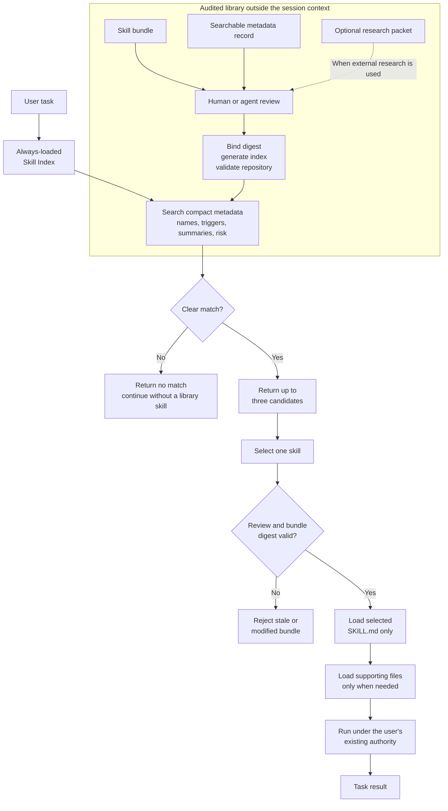

# Skill Index

A provider-neutral library of audited Agent Skills with search-first loading,
exact bundle identity, and compact research provenance.

The repository is intentionally simple to browse. Skills describe one job,
records carry routing and lifecycle metadata, and research packets explain
where ideas came from and why alternatives were adopted or skipped.

## TLDR

- Hosts expose one small `skill-index` bootstrap skill instead of placing the
  whole library in every session.
- The bootstrap searches compact metadata, returns at most three candidates,
  and accepts no match when none is strong enough.
- Before loading a selected skill, it verifies the review status and exact
  bundle digest. Only that skill and its needed supporting files enter context.
- New skills scale as separate bundles, records, reviews, and optional research
  packets. Generated indexes keep discovery fast and `make check` prevents
  those surfaces from drifting apart.

## How agents use the library

Install or expose only the [`skill-index`](skills/skill-index/SKILL.md)
bootstrap skill. It searches the generated [skill index](index/skills.json),
returns at most three compact candidates, verifies the selected bundle, and
loads only that skill and the supporting files it references.



The full skill list is not placed in ordinary session context.

## Repository shape

```text
skill-index/
  skills/                 Portable skill folders
  records/                One maintained record per skill or domain
  index/                  Generated machine and human indexes
  research/packets/       Concise research and source packets
  reviews/                Review receipts bound to skill digests
  domains/                Domain composition documentation
  docs/                   Contributor documentation
  third_party/            Required upstream notices
  scripts/                Local search, rendering, and validation
  tests/                  Contract and routing tests
  runs/                   Ignored local output
```

## Research without context bloat

Research packets record a bounded question, search method, queries, pinned
sources, inspected paths, licenses, findings, adopted ideas, rejected ideas,
and skipped options. They contain summaries, not raw page dumps.

Skill records link to packet-scoped source IDs. The generated
[research index](research/README.md) lets an agent find relevant evidence before
repeating research, while normal skill use loads none of it.

## Validation

```bash
make review-bind
make index
make check
```

`make check` validates skills, records, research references, review digests,
generated indexes, links, ASCII text, provider-neutral structure, and the test
suite. It requires no secrets or hosted CI.

Read [adding a skill](docs/adding-a-skill.md) and
[research packets](docs/research-packets.md) before contributing.

Applicable third-party notices are preserved in
[third_party/MIT-NOTICES.md](third_party/MIT-NOTICES.md).
