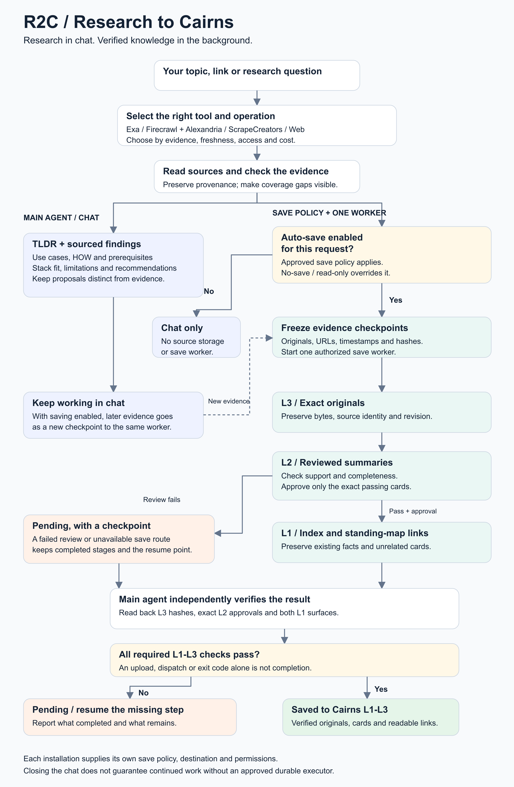
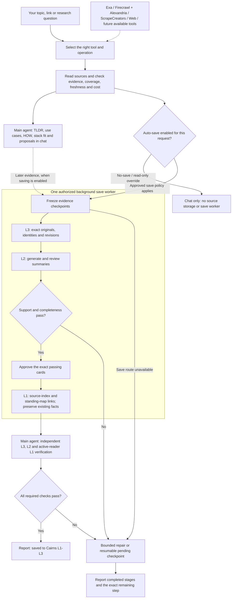

# R2C: Research to Cairns

Research in chat. Verified knowledge in the background.

[Download the PNG](r2c-workflow.png) or use the [editable SVG](r2c-workflow.svg).
The [r2c skill](../skills/r2c/SKILL.md) defines the workflow.

## How it works

An agent selects the relevant operation from available research tools, reads
sources, and explains findings, use cases, how-to steps and stack fit in chat.
It can choose another available operation when a new evidence gap appears.
Discovery does not install a tool or expand permissions or spending.

When an approved automatic-save policy applies, one background worker receives
immutable evidence checkpoints while the main agent continues the research.
An explicit no-save, off-record or read-only instruction disables persistence
and the save worker. Each installation supplies its own policy and destination;
this diagram does not grant permission to store someone else's material.

The worker preserves exact originals in L3, generates and reviews L2 summaries,
approves only the passing cards, and publishes authorized L1 source-index and
standing-map links. Existing facts and unrelated cards are preserved.
Recommendations remain proposals unless separately approved as standing facts.

The main agent independently checks original bytes and revisions, semantic
review and exact approvals, and both L1 surfaces through the active reader.
Only then does it report the packet saved to L1-L3. Failed review, an unavailable
save route or incompatible readback leaves a resumable checkpoint with an
explicit pending state. Permission to save and successful completion are
separate decisions. L4/L5 are outside the default workflow.

Background delegation follows the host's actual lifecycle. Processing after a
chat closes requires an already approved durable executor. The diagram describes
the installed workflow, not evidence that every provider or installation has
passed a live end-to-end save.

## Editable flow

